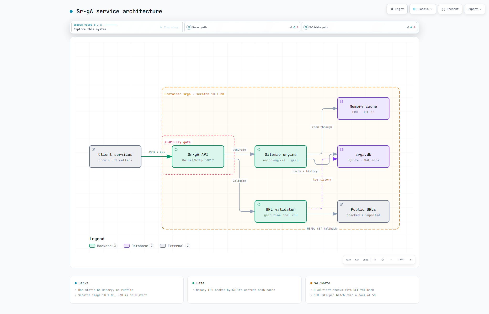

# Sr-gA — Day 26

[](https://go.dev) [](https://modernc.org/sqlite) [](https://www.docker.com) [](LICENSE)

**Local:** `http://localhost:4017` — `GET /` → `{"service":"Sr-gA","version":"1.0.0"}` | `GET /health` → `{"service":"Sr-gA — Sitemap/robots.txt Service","status":"ok"}`

Centralized sitemap + robots.txt generator with concurrent URL validation. **Go 1.22 + net/http + pure-Go SQLite**. Ops tooling for the 30 Services challenge.

> **Docs:** [Interactive Architecture](docs/diagrams/srga-architecture.html) • [Architecture](docs/ARCHITECTURE.md) • [API](docs/API.md) • [ADRs](docs/adr/) • [TDS](Sr-gA.md)

## Architecture — Interactive + Big Preview

[](docs/diagrams/srga-architecture.html)

> **Big preview** (2048×1320 light — 148 KB) — click for interactive pan/zoom + guided views + light/dark + PNG export. Also available: [dark variant](docs/diagrams/srga-architecture.visual-check.2048x1320.dark.png) & [1440×900 light](docs/diagrams/srga-architecture.visual-check.1440x900.light.png). Full showcase: 9/9 checks, 0 errors.

## Stack
- **Language:** Go 1.22 (static binary, no runtime)
- **Router:** `net/http` stdlib pattern routing (no chi)
- **XML:** `encoding/xml` stdlib (+ manual `<?xml?>` header)
- **DB:** SQLite via `modernc.org/sqlite` (pure Go, no CGO)
- **Image:** `FROM scratch` Docker, 10.1 MB, ~30 ms cold start

## Project Structure
```
.
├── cmd/srga/main.go            # routes, middleware chain, graceful shutdown
├── internal/
│   ├── config/config.go        # env loading + slog setup
│   ├── db/db.go                # open, migrate, seed demo keys
│   ├── db/queries.go           # projects, cache, history, stats
│   ├── cache/memory.go         # LRU + TTL, mutex-guarded
│   ├── auth/auth.go            # X-API-Key gate → project in context
│   ├── sitemap/                # model, generator, robots, validator, discover
│   ├── handlers/               # one file per endpoint group
│   └── middleware/middleware.go # recovery, CORS, request logging
├── migrations/0001_init.sql    # 5 tables + indexes (also baked into image)
├── docs/
│   ├── ARCHITECTURE.md         # diagrams + flows + schema
│   ├── API.md                  # full endpoint spec
│   ├── adr/                    # 6 architecture decision records
│   └── diagrams/               # interactive arch HTML + screenshots
├── docker-compose.yml          # srga + srga_data volume
├── Dockerfile                  # golang build → scratch
├── .env.example                # → .env (local, git-ignored)
├── Sr-gA.md                    # TDS v1.0.0
└── README.md
```

## Quick Start (10 mins)

```bash
# 1. Run (Go 1.22+)
go run ./cmd/srga
# → "Sr-gA listening" on :4017, seeds demo keys on first start

# 2. Smoke test
curl http://localhost:4017/health

# 3. Generate a sitemap
curl -X POST http://localhost:4017/sitemap/generate \
  -H "X-API-Key: shop-a-srga-key-2026" \
  -H "Content-Type: application/json" \
  -d '{"urls": [{"loc": "https://example.com/", "priority": 1.0}]}'

# OR Docker (no toolchain needed)
docker compose up -d
curl http://localhost:4017/health
```

## API

JSON in, XML/text/JSON out. Base: `http://localhost:4017` — full spec in [docs/API.md](docs/API.md). Every endpoint except `/` and `/health` needs `X-API-Key`.

### POST /sitemap/generate
```json
{ "urls": [{ "loc": "https://shop-a.com/", "changefreq": "daily", "priority": 1.0 }],
  "pretty_print": true, "compress": false }
```
`200` XML (+ `X-Sr-gA-Cache: miss|memory|sqlite`) | `400` bad URL | `401` bad key

### POST /sitemap/index
```json
{ "sitemaps": [{ "loc": "https://shop-a.com/sitemap-products.xml", "lastmod": "2026-09-26" }] }
```
`200` index XML | `400` empty list | `401` bad key

### POST /robots/generate
```json
{ "rules": [{ "user_agent": "*", "allow": ["/"], "disallow": ["/admin/"], "crawl_delay": 10 }],
  "sitemaps": ["https://shop-a.com/sitemap.xml"], "host": "shop-a.com" }
```
`200` robots.txt | `400` no rules | `401` bad key

### POST /urls/validate ⭐ (for other services)
```json
{ "urls": ["https://example.com/", "https://example.com/missing"], "concurrency": 20 }
```
`200` → `{ total, valid_count, invalid_count, duration_ms, results[] }` | `400` over 500 URLs

### POST /urls/discover
```json
{ "sitemap_url": "https://example.com/sitemap.xml", "include_alternates": true }
```
`200` → `{ url_count, urls[] }` | `502` fetch failed

### GET /history , GET /stats , GET /health
`GET /history?operation=sitemap&limit=5` → `{ entries[], pagination }` | `GET /stats?days=7` → `{ daily[], totals, by_operation }` | `GET /health` → `{ status: "ok", cache }` (no key)

## Testing (cURL) — Local

```bash
BASE="http://localhost:4017"
KEY="shop-a-srga-key-2026"

# generate (miss, then memory hit on repeat)
curl -X POST $BASE/sitemap/generate -H "X-API-Key: $KEY" \
  -H "Content-Type: application/json" \
  -d '{"urls": [{"loc": "https://shop-a.com/", "priority": 1.0},
                {"loc": "https://shop-a.com/about", "priority": 0.5}]}'

# gzip output
curl -X POST $BASE/sitemap/generate -H "X-API-Key: $KEY" \
  -H "Content-Type: application/json" \
  -d '{"urls": [{"loc": "https://example.com/"}], "compress": true}' \
  --output sitemap.xml.gz

# robots
curl -X POST $BASE/robots/generate -H "X-API-Key: $KEY" \
  -H "Content-Type: application/json" \
  -d '{"rules": [{"user_agent": "*", "disallow": ["/admin/"]}]}'

# validate (against local server)
curl -X POST $BASE/urls/validate -H "X-API-Key: $KEY" \
  -H "Content-Type: application/json" \
  -d '{"urls": ["http://localhost:4017/health", "http://localhost:4017/nope-xyz"]}'

# history + stats
curl "$BASE/history?limit=3" -H "X-API-Key: $KEY"
curl "$BASE/stats?days=7" -H "X-API-Key: $KEY"
```

## Integration (for Shop A, Gig4Gig etc.)

1. Nightly cron: `POST /sitemap/generate` with product URLs → write body to `sitemap.xml`
2. Large sites: generate per-section files, then `POST /sitemap/index` to link them
3. Pre-publish: `POST /urls/validate` with new URLs, ship only `is_valid: true`
4. Every generation: append `Sitemap: <url>` via `POST /robots/generate`
5. Repeat identical payloads freely — cache headers (`memory`/`sqlite`) tell you it was free

## Security Notes

- Keys: per-project `X-API-Key` gate, looked up in SQLite, inactive keys rejected
- Demo keys (`shop-a`/`demo`/`test` `*-srga-key-2026`) are dev-only — insert real projects and rotate before exposing
- No secrets in repo — `.env` is git-ignored, `.env.example` is the template
- Validation fetches only URLs you POST; keep the service behind a firewall if exposed
- `/health` and `/` are intentionally unauthenticated (load-balancer checks)

### Ponytail decisions (skipped → when to add)
- No chi/gorilla — 1.22 pattern routing covers 8 routes; add when path params needed
- No mattn/cgo — modernc keeps the scratch image; revisit on write contention
- No Redis — SQLite cache persists across restarts; add when multi-replica needed
- No validation result cache — live state re-checked each call; add TTL cache when rpm demands

## Deploy Checklist

- [ ] `.env` configured (or env vars set, `DATABASE_PATH` on a volume)
- [ ] Demo keys rotated / real projects inserted
- [ ] `docker compose up -d --build` healthy (`/health` → ok)
- [ ] Test generate→validate→history→stats flow
- [ ] Share base URL + API key with consumers

## License
MIT — reuse for all 30 services.
