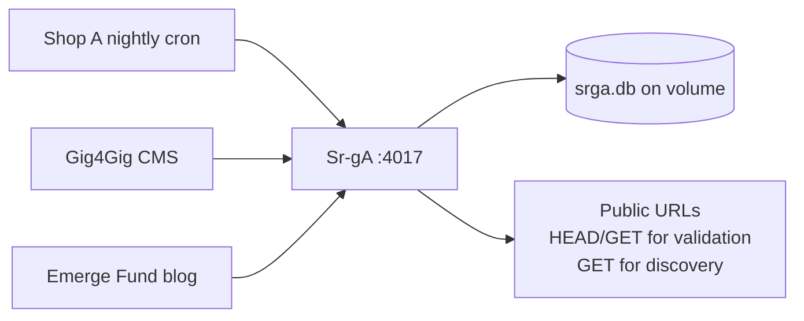
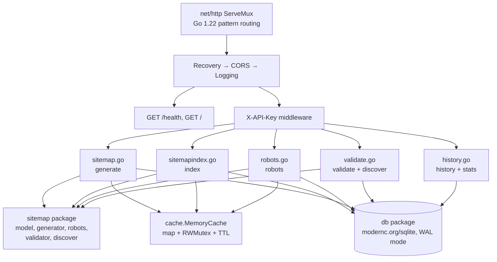
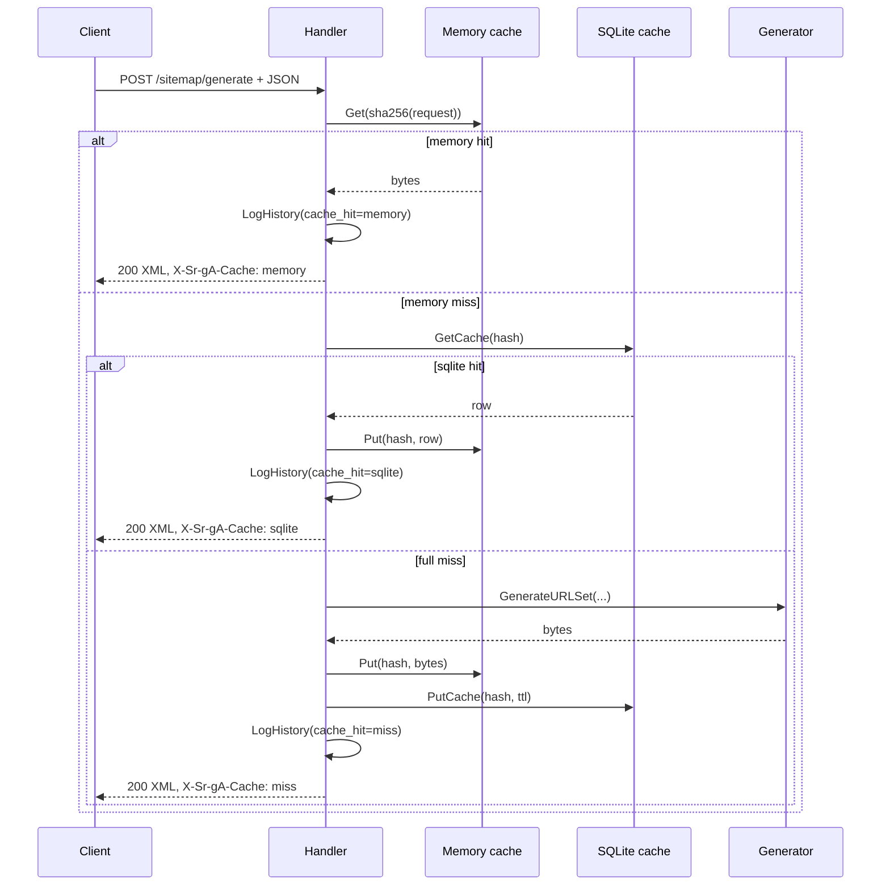
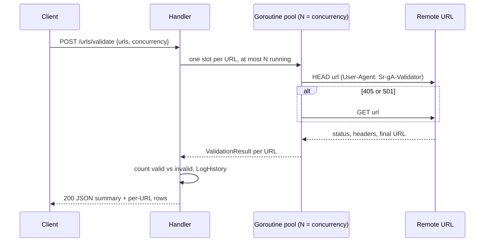
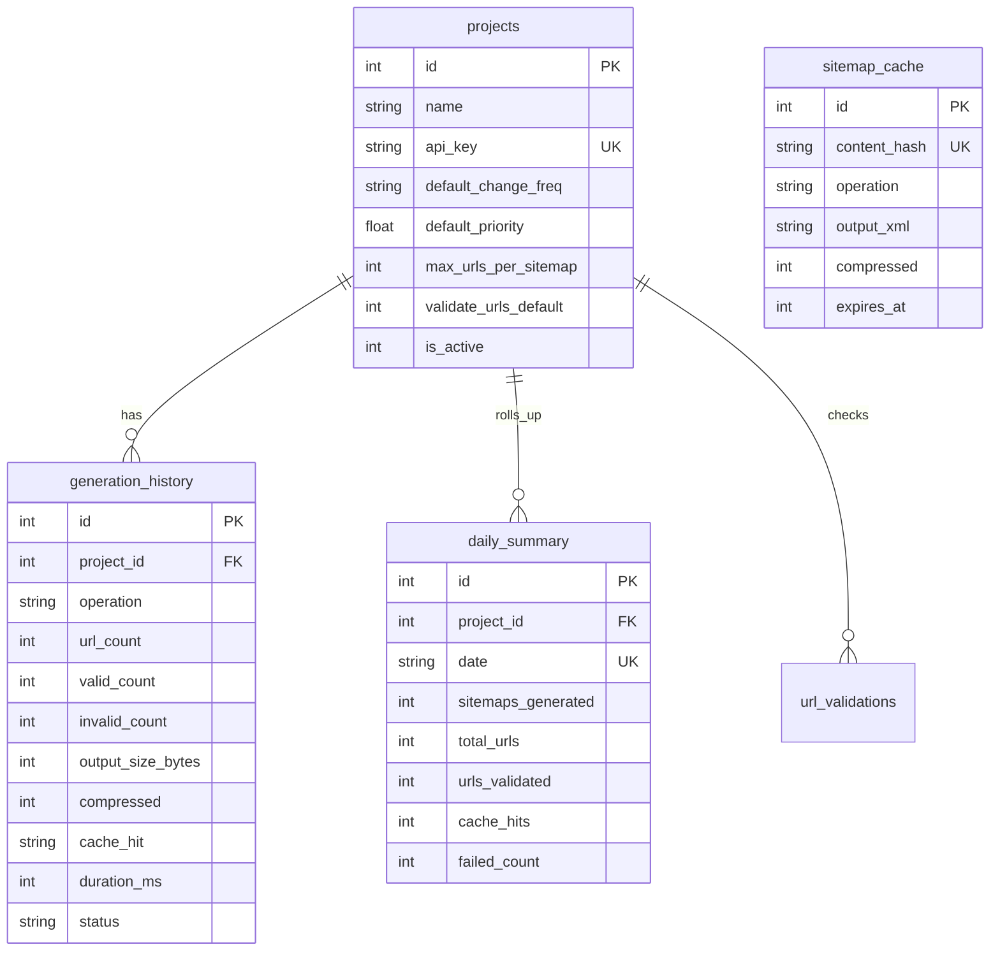

# Architecture

Sr-gA is one stateless Go binary plus one SQLite file. All request state lives in that file, so horizontal scaling means one instance per volume, and backups mean copying `srga.db`. This page maps the system boundary, the code inside the binary, the two request flows that matter, and the schema.

## System context

Client services call Sr-gA over HTTP with an API key. Sr-gA answers from its own database and, only for validation and discovery, makes outbound requests to the public internet.

Sr-gA never calls back into your services. The only network traffic it initiates is the URL checking you explicitly request.

## Inside the binary

Requests pass through three middleware layers, then an auth gate, then one handler per endpoint group. Handlers call the `sitemap` domain package for output, the `cache` package for fast recall, and the `db` package for persistence.

Package responsibilities stay narrow on purpose:

| Package | Responsibility | Key files |
| :--- | :--- | :--- |
| `config` | Read env with defaults, configure JSON logging | `config.go` |
| `db` | Open SQLite, run `migrations/0001_init.sql`, seed demo projects | `db.go`, `queries.go` |
| `cache` | Thread-safe in-memory map with TTL and capacity eviction | `memory.go` |
| `auth` | Look up the project by `X-API-Key`, stash it in request context | `auth.go` |
| `sitemap` | Pure output logic with no HTTP or SQL imports | `model.go`, `generator.go`, `robots.go`, `validator.go`, `discover.go` |
| `handlers` | Parse JSON, enforce limits, orchestrate cache and DB, write responses | `sitemap.go`, `sitemapindex.go`, `robots.go`, `validate.go`, `history.go`, `health.go` |
| `middleware` | Panic recovery, CORS headers, per-request slog lines | `middleware.go` |

The `sitemap` package imports nothing from `handlers`, `db`, or `cache`, which keeps generation logic unit-testable without a database.

## Generate flow with two-layer cache

Cache keys derive from the SHA-256 hash of the canonical request JSON, so byte-identical requests share entries across projects and restarts. Memory answers in microseconds; SQLite answers after restarts when memory is cold.

Every branch, including cache hits, writes a `generation_history` row and upserts `daily_summary`, so stats stay accurate when traffic is mostly cached.

## Validate flow

Validation fans out over a semaphore-bounded goroutine pool. Each URL gets a `HEAD` request first with fallback to `GET` on `405` or `501`, which keeps checks light against servers that reject `HEAD`.

There is no cache on this path: validation results depend on live remote state, so each call re-checks. The `url_validations` table exists in the schema for short-lived result storage if a future endpoint needs it.

## Data model

Five tables cover tenants, audit trail, cache, and rollups. Timestamps are Unix milliseconds; booleans are `0`/`1` integers per SQLite convention.

`sitemap_cache` rows expire by `expires_at` and a background goroutine purges them every 30 minutes. `daily_summary` uses an upsert on `(project_id, date)` so concurrent requests never double-count a day.

## Cross-cutting behavior

Three decisions shape every endpoint. Graceful shutdown drains in-flight requests for up to 10 seconds on `SIGINT`/`SIGTERM`. Structured JSON logs come from `log/slog` with method, path, and duration on each line. SQLite runs in WAL mode with foreign keys on, capped at 10 open connections, which is plenty for an ops tool with bursty traffic.
